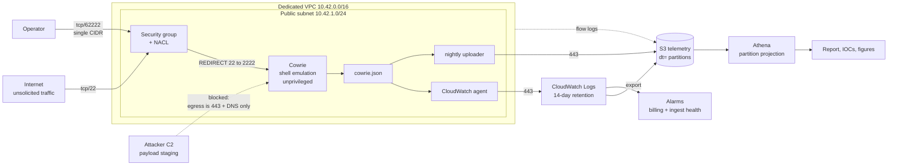

# CloudPot

An SSH honeypot and threat-telemetry pipeline on AWS, deployed and destroyed
entirely with Terraform. Cowrie on a hardened `t3.micro` in an isolated VPC
with contained egress, streaming JSON to CloudWatch and S3, queried with
Athena.

Ran for **7 days in March 2026** on a live internet-facing address in
`us-east-1`. **Payload downloads were blocked** — URLs are recorded, binaries
were never retrieved.

---

## Architecture



**The one thing to notice:** egress is an allowlist, not a default. The
instance may initiate connections to 443 and to the VPC resolver on 53 — and
nothing else. That is what stops a honeypot from becoming someone else's
problem, and it is also why payload downloads fail.

---

## Stack

| Layer | Choice |
| --- | --- |
| IaC | Terraform >= 1.6, `hashicorp/aws ~> 5.0` |
| Compute | Ubuntu 22.04 LTS, `t3.micro`, IMDSv2 required, encrypted EBS |
| Sensor | Cowrie, shell-emulation mode, unprivileged on 2222 behind a netfilter redirect |
| Network | Dedicated VPC, custom NACL, two security groups, enumerated egress |
| Telemetry | CloudWatch agent → CloudWatch Logs → S3, plus an independent on-host uploader |
| Storage | S3: versioned, SSE-S3, public access blocked, 180-day lifecycle |
| Query | Athena with partition projection (no `MSCK REPAIR`) |
| Analysis | Python: `parse_cowrie.py` (stdlib only), `plots.py` (matplotlib) |
| Guardrails | Billing alarm at $20, zero-ingest alarm, VPC Flow Logs |

---

## Key findings

Every figure below comes from real output or is not stated at all. Nothing
here is estimated.

| | |
| --- | --- |
| Deployment window | 2026-03-09 → 2026-03-16, 7 days, `us-east-1` |
| Time to first contact | **5 min 29 s** |
| Total login attempts | 71,442 |
| Unique source IPs | 612 |
| Distinct client fingerprints (hassh) | **23** |
| Successful logins | 3,102 |
| Distinct credential pairs tried | 14,206 |
| Post-auth commands observed | 2,147, in only 418 sessions |
| Attempted payload URLs (none retrieved) | 37, across 24 staging hosts |

**The two numbers to read together:** 612 source addresses, 23 client
fingerprints. Three fingerprints cover 71% of sessions and the largest spans
214 addresses, so the address count overstates the actor count by roughly an
order of magnitude. **And:** 3,102 logins succeeded, but 86.5% of them
disconnected without typing a command — this population is validating
credentials at scale, not breaking in.

Full write-up: **[findings/REPORT.md](findings/REPORT.md)** ·
ATT&CK mapping: [findings/attack_ttps.md](findings/attack_ttps.md) ·
Indicators: [findings/iocs.csv](findings/iocs.csv)

---

## Why downloads are blocked

Capturing samples would give more — static analysis, family attribution,
hashes to pivot on. This deployment gives that up on purpose.

Fetching a payload means the honeypot opening a connection to attacker
infrastructure, which is exactly the traffic the egress containment exists to
prevent. It also means live malware sitting in cloud storage you rent, with
the handling and jurisdictional questions that brings, for a personal research
project that gains little from it.

What is kept is still actionable: the URL, the staging host and port, the
command used to reach it, the source and the timing — enough for blocklists
and detection rules, and pivotable against passive DNS and public sandbox
reporting without anyone here touching a binary.

What is lost is stated in the report rather than glossed over: no static
analysis, no family attribution, and in almost all cases no hash.

Full reasoning: **[docs/SAFETY.md](docs/SAFETY.md)**.

---

## Quick start

```bash
cp terraform/terraform.tfvars.example terraform/terraform.tfvars   # edit first
make deploy
make fetch && make parse && make plot
make destroy
```

> **After deployment, port 22 is the honeypot. The real sshd is on 62222.**
> Connecting to 22 gives you a convincing fake shell and logs your keystrokes
> into the dataset. The bootstrap verifies sshd is listening on 62222 *before*
> handing port 22 to Cowrie — see [docs/SETUP.md](docs/SETUP.md).

Cost is roughly **$9 per 7-day run**, dominated by CloudWatch Logs ingest.

---

## Documentation

| | |
| --- | --- |
| [docs/SETUP.md](docs/SETUP.md) | Prerequisites, deploy, verification, cost, troubleshooting |
| [docs/SAFETY.md](docs/SAFETY.md) | AWS AUP, egress containment, download policy, incident response, retention |
| [docs/TEARDOWN.md](docs/TEARDOWN.md) | Destroy order, emptying versioned buckets, cost verification |

Every Terraform resource carries a comment stating its security rationale.
Start with `terraform/vpc.tf` (NACL egress) and `terraform/iam.tf` (role
scoping) — those two files hold the decisions worth arguing about.

## License

MIT — see [LICENSE](LICENSE).
